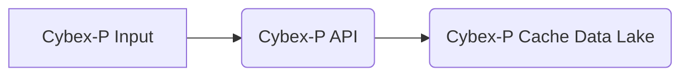


# Cybex-P API Module

The `Cybex-P API Module` is the gateway for all data that travels in and out of Cybex-P during collection and posting. Cybex-P API is combintation of two sub-modules; the *Data Input sub-module* and the *Report Publishing sub-module*. The *Data Input sub-module* deals with the parsing of posted raw data and transferring of it to the backend. The *Report Publishing sub-module* deals with the handling of report request and the returning of any available ports to the user. In addition to being the gateway to the Cybex-P services, The API module also works as another checkpoint of additional privacy preservation  in which the data gets further encrypted. 

# Cybex-P API Repositories
the `Cybex-P API Module` and it's sub-modules is comprised of the following three modules.
 - `API`
	 - URL calls
	 - Frontend to backend services
 - `views`
	 - Privacy preservation
	 - Report querying and status updates
	 - Data parsing and processing
 - `Resources`
	 - Token validation
	 - User authentication
	 - Appending of new users and organiztion 
	 - Configurations
	 - Access control Lists

## API

the Cybex-P `API` (not to be confused with `Cybex-P API Module`, which is the entire backend API module) is where URL calls are made depending on the type of desired service. The `API` modules web backend runs off the Falcon framework.

The following calls can be made to `Cybex-P API`:
|URL/Routes                |TYPE	| FUNCTION                         |
|----------------|-------------------------------|-----------------------------|
|`/ping`|PUT |Utility call to ping the backend            |
|`/query`|GET           |When called, checks the status of the previously provided data set and returns it if available            |
|`/raw`          |POST|Call the `raw` module and proceeds to parse and prepare the inputted data to be sent to the cache data lake|
|`/test/token`          |POST|Call the `resource` module and validate the provided token|
|`/get/my/hash`          |GET|Provide that authentication is valid, returns the user_object.hash of the caller.|
|`\login`          |POST|Take the provided and POST data and authenticate the login instance|
|`/add/user`          |POST|Register a new user|
|`/add/org`          |POST|Register a new organization|
|`/change/org/acl`          |PATCH|Adjust and modify an organizations Access Control List|

## Views
The Views module is a respository of various functions and utility that encompass the funtionality behind `Cybex-P API Module`'s two sub-modules. The *Data Input sub-module* utilizes the `raw` module for the handling of raw data posted to the API while  *Report Publishing sub-module* utilizes the `query` module for the handling of report request made by users. Both sub-modules also rely on the `crypto` repository to handle the encryption of posted data and querys made by users.

- **`raw`**
	- Raw data that is supplied from the frontend arrives at the ***Raw*** module. When called, it pulls the database config information and issues a timestamp index for the call. ***Raw*** then takes the raw unfiltered data (which comes in the form of an ***Input Configuration Object*** that is passed to it) and begins to parise it. That raw data arrives in the form of a long list of strings that is scanned for the following mandatory keys:
	> - typetag
	>- name
	>- orgid
	>- timezone
	>- config_hash
	-	Once the The above tags have been identified. The data to be processed along with the identifying tags get encrypted with the public key of the archive server and gets stored in the cache data lake.
- **`query`**
	-  The query module is responsible for the handling and retrieval of report queries made to the backend. When called, all forms of input data are encoded into a canonical formatting and then encrypted via the `crpyto` module. A report query is then made via the  Cybex-P language ***TDQL***.
	> ***query  =  TDQL(qtype, enc_qdata, qhash, userid, time.time())***
	> - qtype -> data itype
	> - enc_qdata -> JSON of the data query
	> - qhash -> sha256 hexdigest of the data
	> - userid -> hash of the user who requested the report
	> - time.time() -> timestamp of the report query
	- If a TDQL call returns with a status "ready". the entire report is handed off to the responds media and returned to the client. Otherwise, the status will be indicated as "processing" and will prompt with an additional message "check back later".
- **`crypto`**
	- The crypto module is a utility-based module used by both the `query` and `raw` module and is largely responsible for providing and handling the privacy preservation aspect of the `Cybex-P API Module`. The modules sole function is take the the provided API POST data (when called by the other 2 modules) and encrypt it with the public key of the archive modules' server.
	> -  def encrypt_filfe( fbytes, fpub_name="pub.pem") 
	- Before the data itself gets encrypted, a 32-byte long session key is generated and encrypted with the provided public RSA key (by default the public key is stored in "pub.pem"). Once the session key is encrypted, the data gets encrypted with the AES session key. 
	>- enc_session_key  =  cipher_rsa.encrypt(session_key)
	- A string made out of the concatenation of the encrypted session key, nonce, tag, and ciphertext is then returned as hash that works as an identity hash of the encrypted data.
	>-  dout = enc_session_key + cipher_aes.nonce + tag + ciphertext
	>- return dout

## Resource
The resource module contains a variety of decorator functions and utility functions meant to handle and support the more miscellaneous task of the `Cybex-P API Module`. Some of these task include:
- Token authentication
-  Login authentication
-  Hash supplying
-  User preferences and configuration
-  New user and organization registration

The following are *decorator functions* used across multiple modules of the `Cybex-P API Module` to assist with various responsibilities:
>- ***validate_token()*** - Decorator function that checks the validity of a token, failures will return a response code of 401. tokens are received from request_data["token"] of a user request,
>- ***extract_request_data()*** - Decorator function that grabs the data from the falcon request objected and passes it to the decorated function as *'request_data'*. The *required_fields* parameter is often used with the decorator to properly extract certain pieces of data within a query; otherwise, the request_data will only contain the timestamp of the call.
>- ***exception_handler()*** - This decorator function is in tandem with almost all other functions and API endpoint calls in the API module. the exception handler signals on any errors such as a bad HTTP request, Invalid input, and if the backend is currently down and/or not working properly.
> - ***early_return()*** - Utility dectorator used by other decorators as a way to early return from any function call if a decorator calls for an early return.
> - ***get_org_object()*** - checks to see if the key `org_hash` is present within the argument `request_data`. If it fails, then a response code 400 is returned. This decorator will pull *'org_hash'* from *request_data["org_hash"]* and place the org tahoe object under *org_object*.