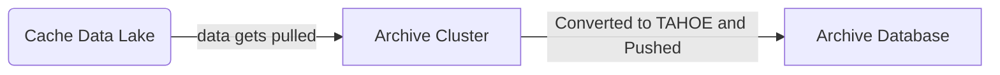

# Cybex-P Archive Module
The `Cybex-P Archive Module` is the next step in the process of threat data after being previously pushed to the cache data lake by the `Cybex-P API Module`.  This module has the prime responsibility to pull data from the cache data lake and parse it into a ***TAHOE*** object. Once parsed, it is then pushed and stored to it's database server in which it will await to be used by the `Cybex-P Analytics Module`.

The `Cybex-P Archive Module` is compromised of two modules that work in cohesion with each other on different servers. The ***Archive Cluster*** and the ***Archive Database***.

- ***Archive Cluster*** 
	-  Decryption of data
	-  Threat data to TAHOE object conversion
- ***Archive Database***
	- Storage of the newly parse TAHOE object
# Cybex-P Archive Module Repositories
- `archive [Source Code]`
	- Data decryption
	- Data Archiving
	- Module Initialization and Execution
- `parsemain [Source Code]`
	-  Data Parsing
		- Turning a piece of data into a Raw ***TAHOE*** object

# archive

`archive` is the core source code of the `Cybex-P Archive Module`  since alot of the main functionality takes place here. Everything from data decryption to archiving takes place in this module.

***Key Functions***:
> -	**decrypt_file**(file_in, fpriv_name = "priv.pem")
> -	**archive_one**(event, cache_coll, fs, pkey_fp, parsemain_func)
> - **archive**(cacheconfig, force_process = False, exec_once = False)

- `decrypt_file()`: 
	- This function is only used by ***archive_one()*** and is used to decrypt threat that has been previously encrypted with the public key of the `Cybex-P Archive Module`. When called, a file of the set of threat data is passed in along with the private key of the of the module (by default, the private key is under "priv.pem"). **decrypt_file()** go ahead and validate the file to ensure correct format. Once validated, the private key is pulled and the session key, nonce, tags, and ciphertext are extract from the private key. The session key is then decrypted with the private RSA key and the data gets decrypted with the AES session key. The threat data is then returned in *utf-8* formatting.
- `archive_one()`:
	- **archive_one()** is responsible for taking a single event provided to it and administrating decryption and  TAHOE parsing methods to process the data. Like the ***decrypt_file()*** function, this function is only used by one other function: ***archive()*** [See below]. This function utilizes **decrypt_file()** in its definition take the provided byte data and return the raw threat data. A call is then made to the **parsemain()** function (defined as *parsemain_func* within the definition of this function) to take the provided threat data and parse it into a raw TAHOE object. When the data proceeds to get parsed, the result of the parsing will come back in 1 of 3 states administrated by **parsemain()**:
		-	 ***SUCCESS*** - The parsing was successful and will be updated to the Archive module database with its reference hash
		-	***NOT_SUPPORTED*** - An attempt at parsing the passed data was made but the type of data that was passed is an unsupported sub-type. The data will be sent to the database with the **"skip"** set to True.
		-	***ERROR*** - An attempt at parsing the passed data was made but an error was caught during the the function call. With an error case, a object of ***Nonetype*** is returned and updated to the database with the ***"skip"*** flag set to true.
- `archive()`:
	- ***archive()*** Is the main controlling function of the `archive` source code. When executed, the function while go into an infinite while loop that will consistently be checking for a provided cache configuration and proceed to set the path to the Archive database and tunnel to grab data from the cache data lake. 
	- The rest of ***archive()*** is then an infinitely running while loop that is consistently querying the the cache data lake for available raw threat data provided from the `Cybex-P API Module`. However, to save resources and optimize performance, ***archive()*** has a an exponential backoff method that is ran after every query attempt. 
	- The exponential backoff method is ran after every query and is meant to sleep the system for a certain amount of seconds in order to decrease the rate of querying in order to keep a stable rate of querys. If success is achieved after a single query and archive attempt, the amount of accounted failed attempts is reset to 0.
	>	- n_failed_attempts -> The number of failed attempts so far after ***every*** recent failed query. 
	>	- ***exponential_backoff***(n_failed_attempts)
	
	-	E.G: If *n_failed_attempts* is currently set to 3, meaning 3 querys were made and ended up being failed attempts, the exponential backoff function sleeps the archive module for a certain amount of seconds based on the following function:
	>	-	s = min(3600, (2 ** **n)** + (random.randint(0, 1000) / 1000))
			time.sleep(s)
			#Where **n** = n_failed_attempt

	-	Otherwise, if a successful query was made, *n_failed_attempts* is set back to 0 which will lead the archive module to increasing the rate of query and archive attempts again. 

# parsemain
The `parsemain` source code is a key sub-component that is utilized by the `archive` code to handle the responsibility of parsing threat data to the raw TAHOE objects that will eventually be used by the `Cybex-P Analytics Module`.

***Key functions***:

> - parsemain(typetag, org id, timezone, data)

-	`parsemain()`:
	-	parsemain is the sole function that is responsible for taking a single event of threat data and parsing it into a raw TAHOE object.  