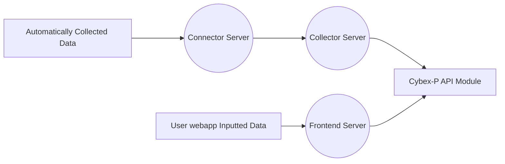

# Cybex-P Input Module
The `Cybex-P Input Module` is reponsible for the collection of threat data provided from user input and to populate it to the `Cybex-P API Module`. the The Input module is located Inside the collector server and partially in between the The frontend client and `Cybex-P API Module`.  Users can manually post threat data through the frontend web client or let handling be done automatically via the connector server to the collector.

Examples of automatic data collection include:
> - Calling an API
> - A pre-configured websocket
> - reading from a text file
> - reading from a database
> - Using linux syslog protocol

The following flow chart is a smaller scale summarization of the flow of data to the `Cybex-P API Module` via the `Cybex-P Input Module`:

# Cybex-P Input Repositories

The `Cybex-P Input Module`   is a python websocket-based module that is compromised of multiple ***plugins*** for the handling of threat data and any other input. Plugins are their own seperate add-ons that are utilized by the two modules below: 

- `PluginHandler`
	-  Setting API url, Token authentication, backend identity configurations, plugin execution
- `PluginManager`
	- Socket Management, configuration status, 
- `input`
	- System Input call and execution

running and executing configts, API configuration, plugin configurations

Of the current the current six plugins that are present in the respository, four of the plugins are open source threat intelligence platforms while the other two plugins are entities that are fully native to the `Cybex-P Input Module`. The  ***plugins*** themselves are comprosed of the following services:
- `common`
	- Cybex Source Fetching, Exponential backoff, Cybex Sources
- `misp_api`
	-  MISP api with python wrapper. Malware information sharing platform; Open source threat intelligence 
- `misp_file`
	-  MISP file input
- `openphish`
	- phishing intelligence platform
- `phishtank`
	- phishing intelligence platform
- `websocket`
	- Lomond websocket plugin
# Plugins

- `Common`
	- As it's name states, `common` is a module that contains cybex plugin utility that is used by the other plugins within the `Cybex-P Input Module`. 

- `misp_api`
	- foo
- `misp_file`
	- foo
- `openphish`
	- the openphish plugin
- `phishtank`
	- foo
- `websocket`
	- foo
# Module setup and execution
- foo

