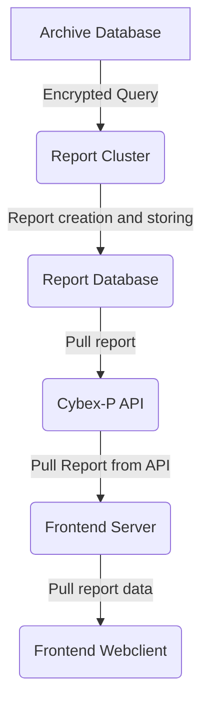
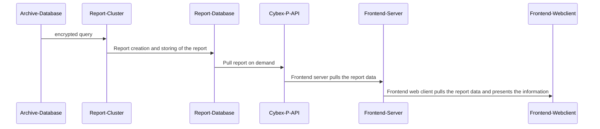

# Cybex-P Report Module
The `Cybex-P Report Module` is the final stop of processing for threat data in the system and where reports are generated and provided to the frontend web client.

Cybex-P has a unique way in storing cyberthreat data in which the data is stored in graphs and the vertices amongst those graphs represent various attributes or events. Because of the way data is stored, Cybex-P has it's own unique way of generating insightful reports.  

In regards to complexity in terms of the information provided from a report, a report can be something as straightforward as countign the occurences of a specific IP address within a time range to the correlational analysis of the attributes of a single URL. 

***Data Pipeline***
-	the pipeline for a report request is represented by the following:

# Cybex-P Report Module Repositories
-	`report [source code]`:
	-	setting time range of a record
	-	raw threat data parsing
	-	query decryption
	-	Report types:
		-	Attribute occurence counting
		-	Related sub_type 
		-	Threat rank processing
# report
The report repository is the source code that is entirely responsible for all aspects of the `Cybex-P Report Module`. The report source code is split up into various sections for handling report generation and queries:
-	timelime recording and administration
-	file decryption (for report querys made by the frontend client)
-  query decanonicalizing
- 	report type generation
- report transferring via sockets

***key functions***:
> - get_dtrange()
> - decrypt_file()
> - main code // <--- rest of the main code, not a function

- ***get_dtrange()***
	- 
	- parameters:
	> - ***from_*** = timeline value of when the threat data was received
	> - ***to*** = timeline value of when the session of the  threat data was completed
	> - ***last*** = last valid timeline value of the threat data
	> - ***tzname*** = name of the timezone of the current user

	- This function is responsible for translating the timeline of the provided threat data and parsing it
into the local timezone of the user who made the query.

- ***decrypt_file()***
	- 
	- the decrypt_file() functions works as exactly like the decrypt_file function located in the `Cybex-P Archive Module`. In this case its purpose serves to decrypt the querys provided from the `Cybex-P API Module`. 

- ***Main***
	- 
	- ***NOTE***: "Main" is not an actual function. Main is just a title that represents the rest of the main functionality of the ***report*** source code.  The rest of the source code is wrapped functionality that is consistently ran in an infinite (while) loop.
	- This is the main body of the code where most of the actual report generation takes place.  At execution, the code will immediately seek all existing available querys from the report backend identity. 
	> - r = _REPORT_BACKEND.find({'itype': 'object', 'sub_type': 'query', '_cref': await_hash}, _P) 
	
	- All querys are stored within the variable **r** (within the source code). Once all currently existing querys are pulled from the backend, We begin to to iterate through the list. With each iteration, we begin by parsing the query into a TAHOE TQDL query and set its status to a 'processing' state.
	> - tdql = parse(i, backend=_REPORT_BACKEND) tdql.status = 'processing' 

	-	The query is then evaluated and decrypted from by the **decrypt_file()** function.
	> -	ciphertext_query = eval(tdql.qdata)
	> - canonical_query = decrypt_file(ciphertext_query)
	> - query = decanonical(canonical_query)
	
	- Proceeding the file decryption, the timelime values are extract from the query and the **get_dtrange()** function is called to set the timelime according the timezone of the query.
	> - from_ = query.pop('from', None)
	> - to = query.pop('to', None)
	> - last = query.pop('last', None)
	> - tzname = query.pop('tzname', None)
	> - try:
		---	start, end = get_dtrange(from_, to, last, tzname)
	
	- At this point we can proceed to othe actual generation of the report requested by the query. Recall from this modules repository that we have three different report generation types; these three different report types are labeled, in Cybex-P terminology as:
		- `count`:
			- A report based on the on the number of occurences of a specific attribute as indicated by the sub type from the query
		- `related`: 
			- A report based around all events related to a specific attributed within the provided time range of the query
		-	`threat rank`:
			-	A report based on generating the threat rank of an event. This sort of report is more complicated compared to the other report types as this report requires running the an even through Cybex-P's own threat rank evaluation algorithm.

	-	In the event that none of the report types above correlate to the report type that is requested by the query. the query status is set to "failed".
	> - query.status = 'failed'
	
	- Once the 	the report or done generating (or the query is marked a "failure), we can go ahead and extract the report and encode all related parts of the query into a block of bytes.
	> -	if not isinstance(nonce, bytes):
	> -	--- nonce = nonce.encode()
	
	- At the final step, we use websockets to connect to the host API and send the report back.
	> - sock.connect((host, port))
	> - sock.send(nonce)

	-	At this point, the ***Main*** will continue to the previous steps for the rest of the querys stored in the ***r*** variable. Once all querys are completed, we go back to the initial step and extract any recently created querys that are stored in the Report backend.