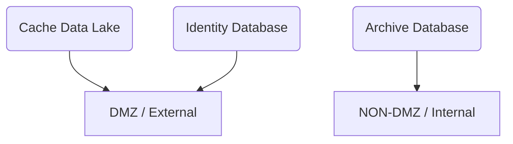

#  Cybex-P Installation guide

## Environment setup and Tahoe Installation
To set up the the Cybex-P backend run the following list of commands.

**Note**: Operating System used: Ubuntu (Debian)

- Create the python environment
	- Depdendencys:
		- Python3.9
		- Python3.9 Headers

`$: sudo apt-get install python3.9 python3.9-dev`

***NOTE***: While it is not required, it is recommended when installing all the Cybex-P modules that each modules should have it's own virtual environment to hold all of its dependencies.

## TAHOE Installation and setup
-	Downloading The Tahoe Module Code:
```
$: `git clone https://github.com/CYBEX-P/tahoe.git`
```
- Activate the Tahoe virtual environment
```
$: `python3.9 -m venv <venv-name>`
$: `source <venv-name>/bin/activate`
(example_name)$: //<------- You should be in your virtual environment now
```
- For activating on Windows ---
```
$: `python3.9 -m venv <venv-name>`
$: `<venv-name>/Scripts/activate.bat`
(example_name)$: //<------- You should be in your virtual environment now
```

- Installing Tahoe Dependencies into Tahoe's virtual environment
```
(example_name) $: `pip install -r  <project-dir>/requirements.txt`
(example_name) $: `cd tahoe`
(example_name) $: `python -m unittest` (optional)
runs unit test (optional)
```
-	Installing  Tahoe
```
(example_name) $: `python3.9 setup.py install`
```

### Identity Secret Key
Each Cybex-P has a secret key located in Tahoes Identity class that acts a global key for your entire Cybex-P internal system. When Tahoe gets installed on multiple systems across, all those systems that are yours must have the exact same secret key.

To generate this key, do the following:
-	Generate the copy
`python3 -c 'import os; print(os.urandom(16).hex())`
- This will generate a 16-byte string that will act as your cryptographically secure key.
- For all installation of Tahoe on your internal system, go to the following repository
` tahoe/tahoe/identity/identity.py`
- Within the source code, within the class `Identity`, place replace the value of the varilable ***secret*** with your 16-byte string
```
class Identity(tahoe.Object):
- Secret = """Your 16-byte string here"""
```

***For anything that uses the Tahoe identity module, please change the secret key value to the key you've generated***

## **Input Module Installation**
- Create and activate a python virtual environment 
```
$: python3.9 -m venv $(example_name)
$: source example_name/bin/activate
(example_name)$:
```
- Install the module requirements
```
(example_name)$:cd cybexp-input
(example_name)$:pip install -r requirements.txt
```


- ***Configurations***
	- In the root of module/project there will be a `config.json` that has all the database configurations, URLs, and other content related to the database identities. If it is not found or has incorrect configuration parameters, The input module will default to `localhost` database configurations.


- the following is what you'll see and need to configure within the `config.json`:
```
{

	"api" : {
	"url" : "https://cybex-api.cse.unr.edu:5000",
	"host" : "cybex-api.cse.unr.edu",
	"port" : 5000,
	"protocol" : "https",
	"token": #YOUR API TOKEN GOES HERE
	},

	"cache" : {
	"mongo_url" : "mongodb://cici-api/",
	"db" : "cache_db",
	"coll": "file_entries"
	},

	"report" : {
	"mongo_url" : "mongodb://cici-api/",
	"db" : "report_db",
	"coll": "instance"
	},

	"identity" : {
	"mongo_url" : "mongodb://cici-api/",
	"idenity_db" : "identity_db",
	"coll": "instance"
	},

	"tahoe": {
	"mongo_url": "mongodb://mongo1,mongo2,mongo2:27020/?replicaSet=rs0",
	"db": "tahoe_db",
	"coll": "instance"
	},

	"analytics": {
	"mongo_url": "mongodb://mongo1,mongo2,mongo2:27020/?replicaSet=rs0",
	"db": "tahoe_db",
	"coll": "instance"
	},

	"archive": {
	"mongo_url": "mongodb://mongo1,mongo2,mongo2:27020/?replicaSet=rs0",
	"db": "tahoe_db",
	"coll": "instance"
	}
}
```

- this is where the module will fetch data to-and-from in regards to the input configurations and where to send (like in the example above, the backend API, or the localhost API).

---


<big> ***Before we initialize the Cybex-P Input module, we'll want to provide some of our own input sources.*** </big>


- The Identity backend should hold input configs that will be ran on initialization of the input module
- after setting up config.json, use the load config module to use the configured parameters


- ***To configure input configurations, we can accomplished this by using the `WebSocketConfig()` function of the identity module of tahoe.***

- For a full example of how to set up input configurations, refer to the [configure_honeypots](https://github.com/CYBEX-P/cybexp-input/blob/farhan/configure_honeypots.py) script in the Cybex-P Input module. Here we will go how to provide an input configuration to the backend

- Open a blank python file and import the following modules:
```
from tahoe.identity import User, Org
from tahoe.identity.config import WebSocketConfig
from loadconfig import get_identity_backend
```
- Grab the identity of the backend (These parameters should be adjusted in your `config.json` file)
```
_ID_B  =  get_identity_backend()
```
-	grab or create a new user from the backend
`user  =  _ID_B.find_user(email='exampleuser@unr.edu', parse=True)`
- grab an organization that user will be appended to
`o = Org('unr_honeypot', u, u, 'UNR Honeypot')`

- Now we can finally set up and initialize our own input configurations, Your input configurations will vary, but below is the method and an example used to send an input configuration to the backend
```
WebSocketConfig(
	"UNR Cowrie Amsterdam",
	"cowrie",
	o._hash,
	"US/Pacific",
	"ws://134.122.58.51:5000/"
)
```
Each parameter is associated with the following: 
"UNR Cowrie Amsterdam" = **plugin name**
"cowrie" = **the type tag of this input**
o._hash = **organization id (or just the hash)**
"US/Pacific" = **timezone**
"ws://134.122.58.51:5000/" = **URL / IP of where this input configuration is located**


- Repeat this process for all available input configurations


- To run your Cybex-P Input Module, execute the following command:
`python3.9 input.py` start


## **API Module Installation**
- Basic Installation:
```
	- (example_name) $: `cd <project-dir>/...`
	- (example_name) $: `git clone https://github.com/CYBEX-P/cybexp-api.git`
	- (example_name) $: `cd cybexp-api`
	- (example_name) $:`pip install -r requirements.txt`
```

- Unit testing:
```
	- (example_name) $:`cd ../cybexp-api`
	- (example_name) $:`python3.9 -m unittest`
```
- Test run the environment:
```
	- hupper -m api
	- curl http://localhost:5000/ping
```


### Running in Production
---

In production, THe Cybex-P API should be ran in tandem with uwsgi and a reverse-proxy like nginx.

The Cybex-P API module is built on the falcon API framework. To set up the Cybex-P API in tandem with the uwsgi and nginx. Please consult this [Falcon API official documentation](https://falcon.readthedocs.io/en/stable/deploy/nginx-uwsgi.html).

## **Archive Module Installation**
- Create and activate a python virtual environment 
```
$: python3.9 -m venv $(example_name)
$: source example_name/bin/activate
(example_name)$:
```

- clone the Cybex-P Archive repository

`git clone https://github.com/CYBEX-P/cybexp-archive.git`

- Install the requirements
```
(example_name)$: cd cybexp-archive
pip install -r requirements.txt
```
- Run the module
```
(example_name)$: python3.9 archive.py
```

## **Analytics Module Installation**
- Create and activate a python virtual environment 
```
$: python3.9 -m venv $(example_name)
$: source example_name/bin/activate
(example_name)$:
```

- clone the Cybex-P Archive repository

`git clone https://github.com/CYBEX-P/cybexp-analytics.git`

- Install the requirements
```
(example_name)$: cd cybexp-analytics
pip install -r requirements.txt
```
- Run the module
```
(example_name)$: python3.9 analytics.py
```
## **Report Module Installation**
- Create and activate a python virtual environment 
```
$: python3.9 -m venv $(example_name)
$: source example_name/bin/activate
(example_name)$:
```

- clone the Cybex-P Archive repository

`git clone https://github.com/CYBEX-P/cybexp-report.git`

- Install the requirements
```
(example_name)$: cd cybexp-report
pip install -r requirements.txt
```
- Run the module
```
(example_name)$: python3.9 report.py
```
## Database Setup and Installation (MongoDB)
Cybex-P uses MongoDB as its relational database in storing and comparing threat data

As for setting up the database, all that is needed is a simple installation of MongoDB. The Cybex-P configuration settings and code will handle the rest at run-time.

To install MongoDB, execute the following commands:
- Install gnupg
```
sudo apt-get install gnupg
```
- importing the MongoDB public GPG key
```
wget -qO - https://www.mongodb.org/static/pgp/server-4.4.asc | sudo apt-key add -
```
- Appending mongodb to apt sources list
```
echo "deb http://repo.mongodb.org/apt/debian buster/mongodb-org/4.4 main" | sudo tee /etc/apt/sources.list.d/mongodb-org-4.4.list
```
- Updating the apt package list
```
sudo apt-get update
```
- Installing the latest stable version of MongoDB
```
sudo apt-get install -y mongodb-org
```
At this point your mongodb installation is complete, execute the following commands to initialize the mongodb systemd daemon:
```
sudo systemctl start mongod
```
If the following prompt comes up:
***Failed to start mongod.service: Unit mongod.service not found.***

Execute the following command:
```
sudo systemctl daemon-reload
```
Then run the systemctl start command again.

For any other concerns and additional functionality and support on MongoDB, consult the following [documentation](https://docs.mongodb.com/manual/tutorial/install-mongodb-on-debian/).

## Cybex-P Database Overview
The ideal Cybex-P database setup contains 3 databases to handle everything:
- 2 external databases located outside in the DMZ
	- Cache data Lake
	- Identity database containing input configurations, users, organizations, and other backend identification data
- 1 internal database
	- The archive data base



## Systemd Services
Each Module of the Cybex-P backend has their own systemd Service file to handle execution and monitoring.

Below you will find a basic example of setting up the systemd service files:

```
#This systemd file executes and maintains Cybex-P's Archive Module

[Unit]
Description=Cybex-P archive Module
After=network-online.target

[Service]
User=cybexp-archive
Group=cybexp-archive
WorkingDirectory=../<proj-dir>/archive
Type=simple
ExecStart=../cybexp/env/bin/python3 ../<project-dir>/archive/archive.py

Restart=on-failure
RestartSec=5

[Install]
WantedBy=multi-user.target

````

In the template above replace the following parameters with the indicated values:
- `../<proj-dir>/` - The full directory leading to where the module is stored
- `archive` - Name of the module for the systemd service file

There should be 5 linux systemd service files that serve and maintain all of the Cybex-P Modules
 ### Creating the service files
 ---
 To make the cybex-p systemd service files, simply do the following
 ```
$: cd /etc/systemd/system
$: touch cybexp_archive.service
$: nano cybexp_archive.service
```
Replace the following to any appropriate name of the module you are constructing the systemd file for:
-	`cybex_archive.service` - the name of whichever module's systemd file is currently being created (E.G: `cybexp_api.service`)

Then write in the template above and adjust accordingly to where your python3.9 cybex-p virtual environment and module is located
### Executing Cybex Systemd Services 
---
Once all systemd service files have been provisioned to the Cybex-P modules. Run the following to command on all service files to execute the modules.
```
$: systemctl start ***
```
- Replacing `***` with the name of a module ( E.G: `cybex_archive` )
