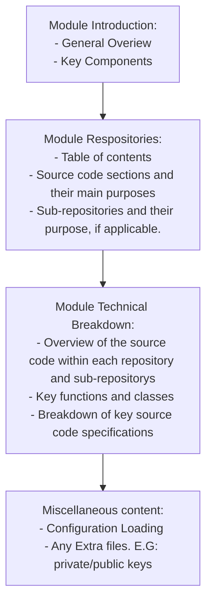

# The Cybex-P backend
Hello! And Welcome to the `Cybex-P backend` documentation. The backend of Cybex-P is where all the magic happens of the entire `Cybex-P` project.

The `Cybex-P backend` consists of everything from the servers that collect threat data, to the API gateway, to the analytical and record administrating modules in the very back. 

In order from where threat data starts traveling from beginning to end, The Cybex-P backend consist of the following 5 modules:
- `Cybex-P Input Module`:
	- Various plugins and utility to help bring threat data to the API
- `Cybex-P API Module`:
	- The gateway between the Analytical/Records backend and everything else. Threat Data validation, encryption, and transferring
- `Cybex-P Archive Module `:
	- Threat data decryption, TAHOE object parsing
- `Cybex-P Analytics Module`:
	- Data correlation and processing
- `Cybex-P Record Module`:
	- Report generation for the frontend

# Documentation Structure and Formatting (How to read)

Each page of the different modules of the `Cybex-P backend` documentation have been formatted uniformly in a way to make understanding of the system comprehensive and easier to digest. The following is a flow chart that acts as a guideline on how all modules are structured and documented. 

-	***1 - Module Introduction***: Each module is first introduced with a superficial explanation of what the module does, the role(s) that it fills in the `Cybex-P Backend`, and how data is processed through that module. Some of the modules will come a flow chart that will either represent *how data is processed through that module* or *the location of that module and general direction of data within the `Cybex-P Backend` system topology*.

- ***2 - Module Repositories***: Like a table of contents, a list of the different code repositories of the backend is displayed here. A repository may either be a single file source code or a directory that leads to many more sub-repositories. Under each repository will be a short definition that represents a functionality that repository is responsible for within its module. 
- ***3 - Module Technical Breakdown***: The technical breakdown consist of diving into each repository's source code and addressing the key functions and classes that comprise that repository. Here, an explanation of those functions is provided along with a comprehensive explanation of it's connections to other source code in the system (or even its connection to other modules, if applicable).
- ***4 - Miscellaneous content***:  Any additional files that don't directly deal with the core responsibilties and functionality of a repository are addressed here, at the bottom of the modules page. These files can be anything from:
	- backend config execution code
	- private and public keys
	- linux systemd service files
	- JSON config files
	- and more 